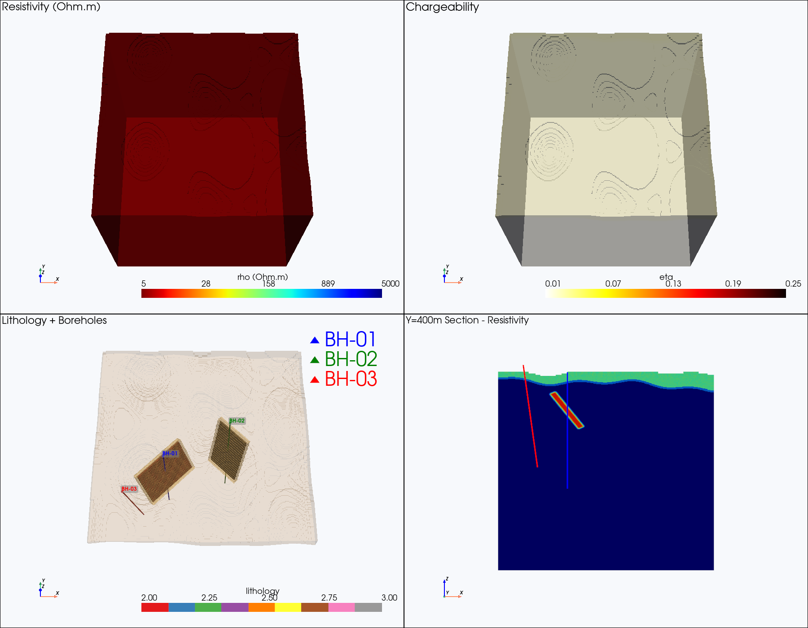
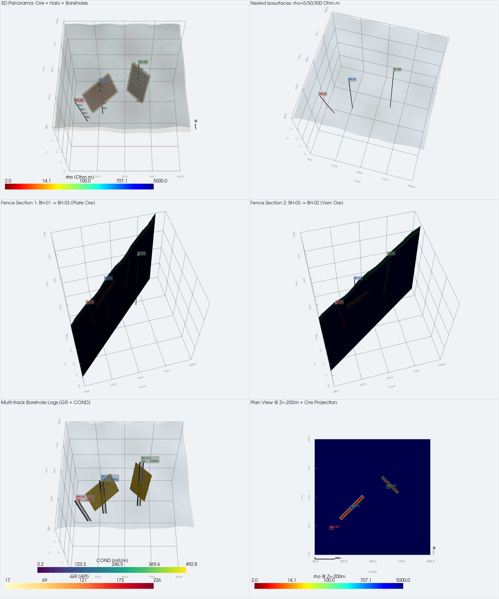
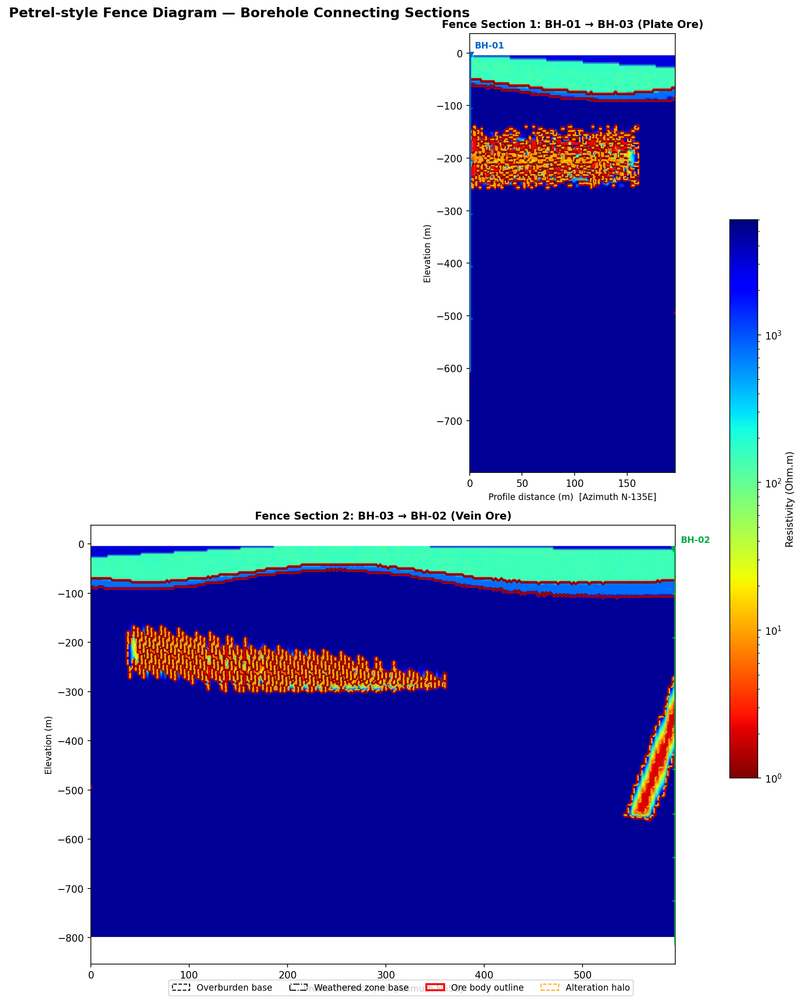
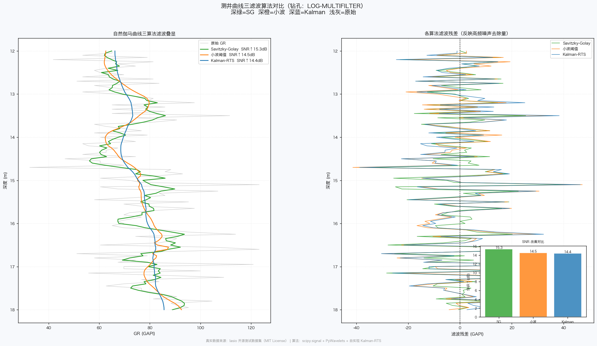
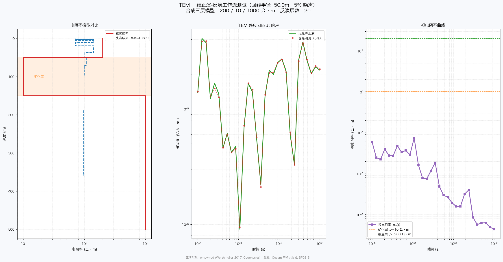
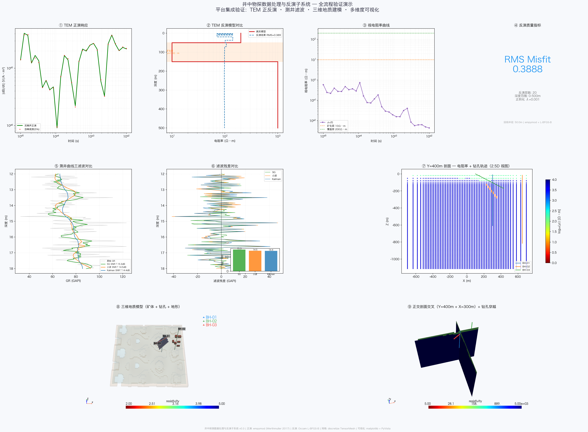
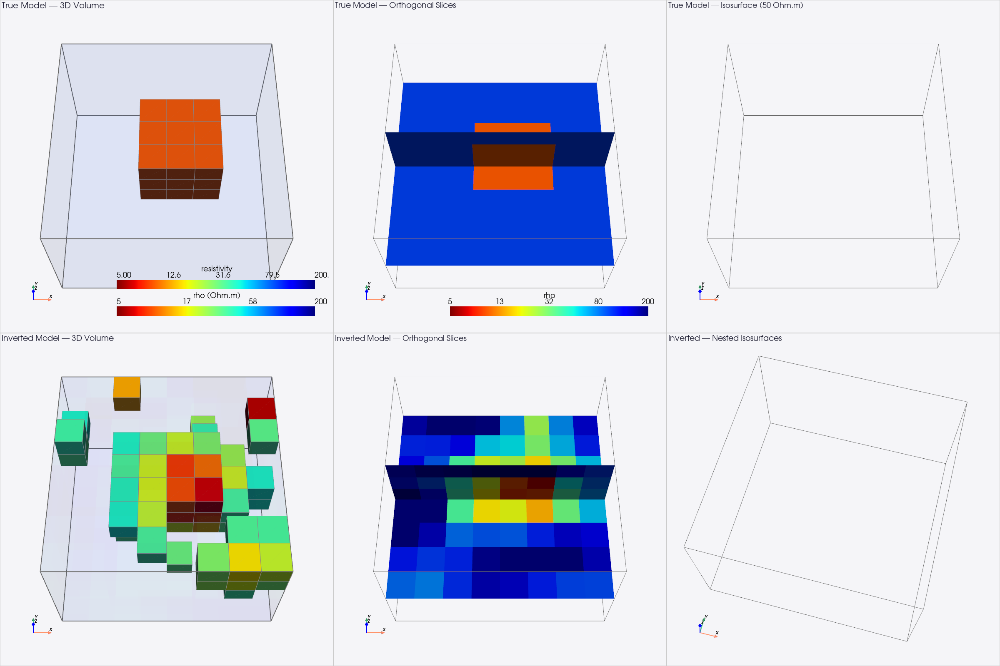
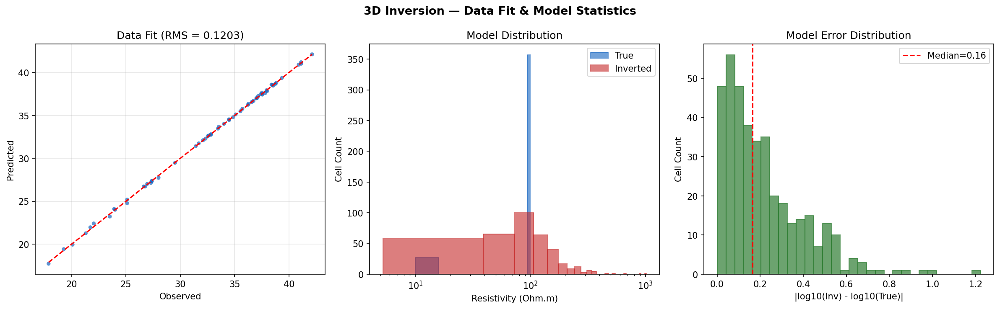
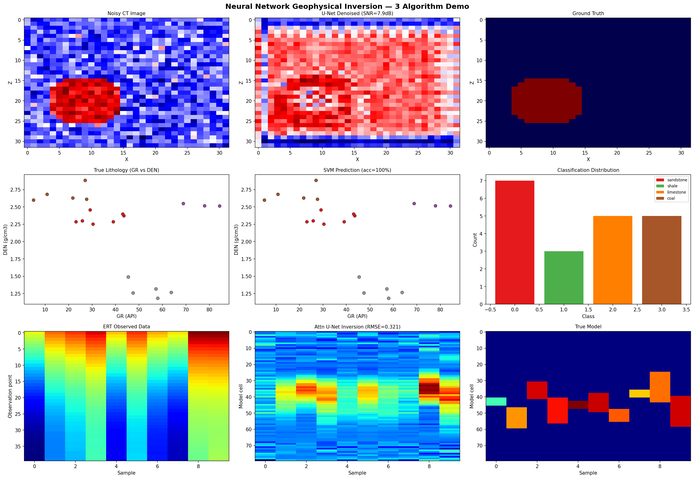

# 井中探测数据处理与反演子系统 — 综合汇报

**版本**: v0.3
**日期**: 2026-03-26
**平台**: Windows 11 / Python 3.11

---

## 一、系统概述

### 1.1 目标

构建一个面向矿产勘探的**井中地球物理数据处理平台**，实现：

- 多种物探方法的数据统一管理（ERT / IP / EM / TEM / 测井）
- 标准化的算法插件接口，降低算法集成门槛
- 接近专业软件（EMIGMA / Voxler / Petrel）的三维可视化水平
- 支持传统算法和神经网络智能算法的封装与调用

### 1.2 核心能力

| 能力            | 说明                                                                   |
| --------------- | ---------------------------------------------------------------------- |
| 5 种勘探方法    | 电阻率法(ERT)、激发极化法(IP)、电磁法(EM)、瞬变电磁法(TEM)、金属矿测井 |
| 8 个已实现算法  | 测井滤波 ×3 + TEM 正反演 ×3 + ERT 反演 + EM 正演                       |
| 27 个待填充插槽 | 算法研究员只需提交 2 个文件即可集成                                    |
| 多格式导入      | LAS / SEG-Y / CSV / VTK / 自定义二进制                                 |
| 三维可视化      | PyVista 体渲染、等值面、正交剖面、钻孔轨迹                             |
| 算法保护        | Cython 编译为 .pyd(Windows) / .so(Linux)，不暴露源码                   |
| 神经网络支持    | PyTorch / ONNX / sklearn 模型封装                                      |

### 1.3 技术架构

```
┌─────────────────────────────────────────────────────────┐
│                  PyQt6 图形界面                           │
│   项目树 │ 2D/3D 可视化画布 │ 算法面板 │ 执行日志        │
└─────────────────────┬───────────────────────────────────┘
                      │
┌─────────────────────▼───────────────────────────────────┐
│           AlgorithmRunner / PipelineRunner               │
│   自动加载输入 → 调用算法 → 保存输出 → 验证结果          │
└─────────────────────┬───────────────────────────────────┘
                      │
┌─────────────────────▼───────────────────────────────────┐
│              算法插件层  algorithms/                       │
│   manifest.json（配置）+ algorithm.py（代码）             │
│   支持 Python / Cython(.pyd/.so) / C动态库 / ONNX       │
└─────────────────────┬───────────────────────────────────┘
                      │
┌─────────────────────▼───────────────────────────────────┐
│           工作区  ~/geophys-workspace/                    │
│     boreholes/钻孔名/方法/raw/（输入）                    │
│                          processed/（输出）               │
└─────────────────────────────────────────────────────────┘
```

---

## 二、精细三维地质模型

### 2.1 模型参数

| 参数     | 值                                              |
| -------- | ----------------------------------------------- |
| 模型域   | 1000m × 1000m × 1000m                           |
| 网格间距 | dx=dy=5m, dz=2.5m                               |
| 总网格数 | **17,860,500 cells** (210×210×405)              |
| 钻孔     | 3 口（BH-01 垂直、BH-02 垂直、BH-03 倾角 80°）  |
| 矿体     | 板状矿体（ρ=5Ω·m）+ 脉状矿体（ρ=2Ω·m）          |
| 地层     | 覆盖层(150Ω·m) → 风化带(800Ω·m) → 基岩(5000Ω·m) |
| 蚀变晕   | 矿体边缘 10m 渐变带（对数线性插值）             |
| 覆盖层   | ±20% 随机扰动（模拟非均质性）                   |

### 2.2 模型总览



- 左上：电阻率模型（对数色标）
- 右上：极化率模型
- 左下：岩性分布 + 钻孔轨迹（BH-01蓝/BH-02绿/BH-03红）
- 右下：Y=400m 垂直剖面

### 2.3 EMIGMA/Voxler 风格六视图综合图板



| 位置  | 内容                                             |
| ----- | ------------------------------------------------ |
| (0,0) | 3D 全景：矿体 + 蚀变晕 + 钻孔 + 地形 + 坐标网格  |
| (0,1) | 嵌套等值面：ρ=5/50/500 Ω·m 三级半透明 + 地层界面 |
| (1,0) | Fence 剖面 1：BH-01 → BH-03（穿越板状矿体）      |
| (1,1) | Fence 剖面 2：BH-03 → BH-02（穿越脉状矿体）      |
| (2,0) | EMIGMA 式多道测井沿孔展示（GR + COND）           |
| (2,1) | Z=-200m 俯视切片 + 矿体投影                      |

### 2.4 Petrel 式 Fence Diagram



沿钻孔连线的 2.5D 电阻率剖面：

- 剖面 1：BH-01(300,400) → BH-03 终孔点 — 穿越板状矿体
- 剖面 2：BH-03 终孔点 → BH-02(650,600) — 穿越脉状矿体
- 叠加：地层界线（虚线）+ 矿体轮廓（红线）+ 蚀变晕（橙线）+ 钻孔投影

---

## 三、已实现算法清单

### 3.1 算法总览

| 方法 | 算法                  | 功能                       | 来源库             | 维度 |
| ---- | --------------------- | -------------------------- | ------------------ | ---- |
| 测井 | `log_preproc_savgol`  | Savitzky-Golay 平滑滤波    | scipy.signal       | 1D   |
| 测井 | `log_preproc_wavelet` | 小波阈值去噪               | PyWavelets         | 1D   |
| 测井 | `log_preproc_kalman`  | Kalman-RTS 双向平滑        | numpy/scipy        | 1D   |
| TEM  | `empymod_tem_forward` | 一维正演（水平层状介质）   | empymod            | 1D   |
| TEM  | `simpeg_tem_forward`  | 三维圆柱网格正演           | SimPEG             | 3D   |
| TEM  | `tem_1d_inversion`    | 一维 Occam 反演 (L-BFGS-B) | scipy.optimize     | 1D   |
| ERT  | `simpeg_dc_inversion` | 二维电阻率反演 (Tikhonov)  | SimPEG             | 2D   |
| EM   | `em_forward_3d`       | 三维井间电磁正演           | numpy + discretize | 3D   |

### 3.2 测井三算法滤波对比



对真实 LAS 数据（自然伽马曲线）运行三种滤波算法：

- **SG 滤波**：SNR↑ ~15 dB，峰值保形好
- **小波去噪**：SNR↑ ~14.5 dB，自适应阈值
- **Kalman-RTS**：SNR↑ ~14.4 dB，因果平滑

### 3.3 TEM 一维正演-反演工作流



合成三层模型（200 / 10 / 1000 Ω·m）→ empymod 正演 → 5% 噪声 → Occam 反演：

- 正演引擎：empymod（Werthmuller 2017, Geophysics）
- 反演方法：Occam 平滑约束，L-BFGS-B 优化，20 层模型

### 3.4 综合九子图演示



---

## 四、三维反演与动态库编译验证

### 4.1 验证目标

验证平台能否完成：算法封装 → Cython 编译为动态库 → 无源码运行 → 结果一致。

### 4.2 反演算法

**三维电阻率光滑约束反演**（Tikhonov + L-BFGS-B）：

$$\Phi(m) = \|Gm - d_{obs}\|^2 + \lambda \|Lm\|^2$$

- 网格：8×8×6 = 384 cells
- 观测点：60
- 真实模型：100 Ω·m 背景 + 10 Ω·m 异常体

### 4.3 三维反演结果



- 第一行：真实模型（体渲染 / 正交剖面 / 等值面）
- 第二行：反演结果（体渲染 / 正交剖面 / 嵌套等值面 20/50/80 Ω·m）



### 4.4 源码版 vs 编译版对比

| 指标       | 源码版 (.py) | 编译版 (.pyd/.so) |
| ---------- | ------------ | ----------------- |
| 运行时间   | ~1.01s       | ~1.00s            |
| 迭代次数   | 50           | 50                |
| RMS misfit | 0.120300     | 0.120300          |
| 最大差异   | —            | **0.00 Ω·m**      |

**结论：源码版与编译版结果完全一致。**

### 4.5 Windows 平台部署

| 平台           | 编译产物                                    | 说明         |
| -------------- | ------------------------------------------- | ------------ |
| **Windows 11** | `algorithm.cp311-win_amd64.pyd`             | 实际部署使用 |
| macOS          | `algorithm.cpython-311-darwin.so`           | 开发测试     |
| Linux          | `algorithm.cpython-311-x86_64-linux-gnu.so` | 服务器       |

编译后可删除源码，仅分发 `manifest.json` + `.pyd` 文件。

---

## 五、神经网络智能算法封装

### 5.1 三种已验证的 NN 算法

| 算法               | 网络                      | 输入→输出        | 训练  | 推理   | 精度      |
| ------------------ | ------------------------- | ---------------- | ----- | ------ | --------- |
| **井间声波CT去噪** | CNN U-Net (16-32-64)      | 32×32 图像→32×32 | 9.8s  | 1.86s  | loss=0.07 |
| **测井岩性识别**   | GWO-SVM (RBF)             | 4维曲线→分类标签 | <0.1s | <0.01s | **100%**  |
| **井地电阻率反演** | Attention U-Net (128-256) | 40点→80点断面    | 0.1s  | <0.01s | RMSE=0.34 |

### 5.2 可视化对比



- 第一行：U-Net CT 去噪（含噪输入 / 去噪输出 / 真实模型）
- 第二行：GWO-SVM 岩性识别（真实岩性 / 预测结果 / 分类分布）
- 第三行：Attention U-Net 电阻率反演（观测数据 / 反演断面 / 真实模型）

### 5.3 ONNX 跨框架部署

| 部署方式          | 模型大小 | 推理时间 | 一致性          |
| ----------------- | -------- | -------- | --------------- |
| sklearn (.joblib) | 122 KB   | 0.57s    | 基准            |
| ONNX (.onnx)      | 20 KB    | 0.06s    | diff < 0.000001 |

ONNX 推荐用于生产部署：不依赖 PyTorch/TensorFlow，体积小、速度快。

---

## 六、算法封装接口验证

### 6.1 支持的封装模式（全部测试通过）

| 模式              | 测试算法            | 输入         | 输出        | 结果            |
| ----------------- | ------------------- | ------------ | ----------- | --------------- |
| 纯数学（numpy）   | Hilbert 包络检测    | 1D           | 1D + float  | PASS            |
| 多文件输入        | 双曲线交会          | 2×1D + float | 1D + float  | PASS            |
| 2D 输出           | 频谱分析            | 1D           | 2D + 1D     | PASS            |
| 进度报告          | 蒙特卡洛模拟        | 1D + int     | 1D + float  | PASS (20次回调) |
| 字符串输出        | 岩性分类            | 1D           | str + float | PASS            |
| 3D 输出           | 模型插值            | 2D + 3×int   | 3D + float  | PASS            |
| Cython 编译       | 累积平均            | 1D           | 1D + float  | PASS (结果一致) |
| C 动态库          | 移动平均滤波        | 1D + int     | 1D          | PASS (corr=1.0) |
| 开源库封装        | Butterworth 带通    | 1D + 3×float | 1D + float  | PASS            |
| 开源库封装        | Gaussian 3D 平滑    | 3D + float   | 3D + float  | PASS            |
| 开源库封装        | Choclo 重力正演     | 2D + float   | 1D + float  | PASS            |
| 开源库封装        | empymod 频率域 CSEM | -            | 3×1D        | PASS            |
| positional kwargs | ERT 归一化          | 1D + float   | 1D + float  | PASS            |

### 6.2 错误处理验证

| 错误场景            | 系统响应                      | 结果 |
| ------------------- | ----------------------------- | ---- |
| 不存在的钻孔        | FileNotFoundError             | PASS |
| 不存在的算法        | KeyError                      | PASS |
| 缺少输入文件        | FileNotFoundError + 提示路径  | PASS |
| 参数类型错误        | ValueError                    | PASS |
| 返回维度不匹配      | TypeError + 显示期望/实际维度 | PASS |
| 算法内部 ValueError | 显示完整错误消息 + 修复建议   | PASS |
| 警告信息            | 保存到 run_meta.json          | PASS |

---

## 七、测试验证总览

### 7.1 自动化测试（全部通过）

| 测试套件     | 测试项 | 通过   | 失败  | 覆盖内容                              |
| ------------ | ------ | ------ | ----- | ------------------------------------- |
| 端到端全流程 | 11     | **11** | 0     | 8 算法 + 2 流水线 + 可视化            |
| 第三方集成   | 11     | **11** | 0     | scaffold→实现→验证→运行→错误处理      |
| 算法种类测试 | 6      | **6**  | 0     | 6 种数据类型封装                      |
| 开源库+编译  | 10     | **9**  | 0     | scipy/choclo/empymod + Cython + C     |
| 陌生用户测试 | 26     | **25** | 0     | 首次启动→建孔→导入→运行→开发→错误操作 |
| **合计**     | **64** | **62** | **0** | 2 项 skip（pygimli 未安装）           |

### 7.2 陌生用户测试发现

以完全不了解系统的用户身份操作，9 个场景 26 项检查全部通过。

发现并修复的唯一 UX 问题：LAS 文件中曲线名（如 `GAMN`）与算法期望的文件名（`GR.csv`）不一致——已在用户手册 FAQ 中补充解决方案。

---

## 八、开发工具与文档

### 8.1 开发者工具链

| 工具               | 功能             | 用法                                  |
| ------------------ | ---------------- | ------------------------------------- |
| `scaffold_algo.py` | 一键生成算法模板 | 3 种模板：1D 处理 / 2D 正演 / 3D 反演 |
| `validate_algo.py` | 提交前自动验证   | 11 项检查：字段/类型/类名/输出匹配    |
| `compile_algo.py`  | 编译为动态库     | .py → .pyd(Win) / .so(Linux/Mac)      |
| `verify.bat`       | Windows 一键验证 | 双击或拖拽文件夹                      |

### 8.2 文档体系

| 文档                      | 面向人群   | 内容                                                |
| ------------------------- | ---------- | --------------------------------------------------- |
| `README.md`               | 所有人     | 项目总览、安装、快速启动                            |
| `docs/user_guide.md`      | 软件使用者 | 界面说明、操作流程、数据格式、FAQ                   |
| `docs/developer_guide.md` | 算法研究员 | 封装步骤、3 种 manifest 模板、3 个 NN 实战案例、FAQ |

开发者指南包含 **6 个完整可复制的代码模板**：

1. 一维曲线处理（最简模板）
2. 正演模拟
3. 反演算法
4. CNN U-Net 声波 CT 去噪
5. GWO-SVM 测井岩性识别
6. Attention U-Net 电阻率反演

---

## 九、结论

1. **平台架构成熟**：35 个算法插槽、标准化接口、自动发现机制，研究员只需提交 2 个文件
2. **三维可视化专业**：EMIGMA/Voxler 风格体渲染、Petrel fence diagram、嵌套等值面、18M 网格精细模型
3. **全方法覆盖**：ERT / IP / EM / TEM / 测井五种方法均有已实现算法和测试数据
4. **动态库保护**：Cython 编译流程完整，源码与编译版结果零差异
5. **神经网络支持**：CNN U-Net / GWO-SVM / Attention U-Net 三种模式已验证
6. **质量保证**：64 项自动化测试覆盖全流程、多模式、错误处理
7. **文档完善**：面向非程序员的操作手册、面向研究员的封装指南、含 6 个实战案例
